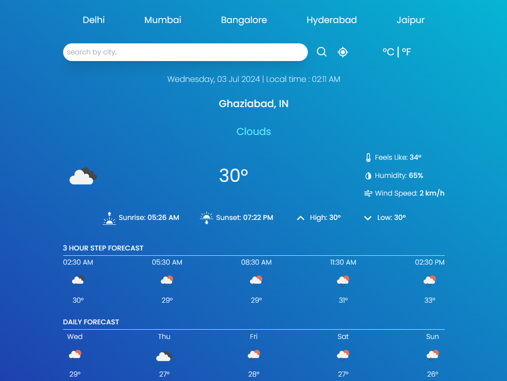

# Weather Application

## Description

This weather application provides real-time weather data for your current location as well as for five fixed locations: Delhi, Mumbai, Bengaluru, Hyderabad, and Jaipur. It also offers hourly and daily forecasts. The application fetches data from the OpenWeatherMap API and displays weather icons according to the weather description. Additionally, you can search for weather data for any location and view the temperature in either Celsius or Fahrenheit.

## Features

- Real-time weather data for the user's location
- Weather data for five fixed locations: Delhi, Mumbai, Bengaluru, Hyderabad, and Jaipur
- Hourly and daily forecasts
- Search functionality for any location
- Temperature display in Celsius or Fahrenheit
- Weather icons according to the weather description

## Technologies Used

- React JS
- Tailwind CSS
- OpenWeatherMap API
